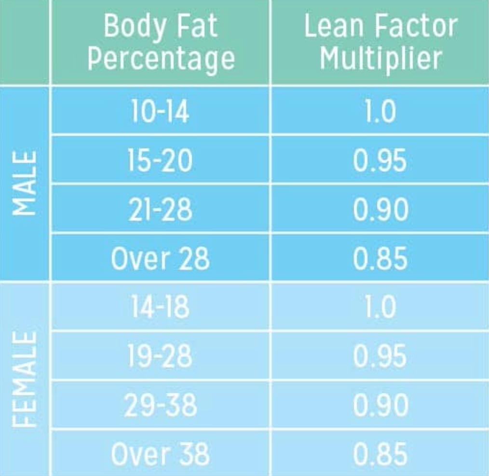
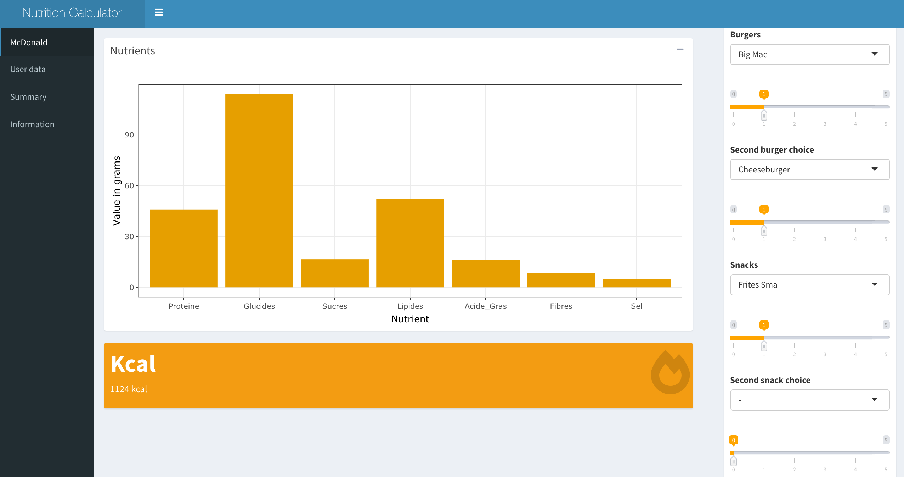
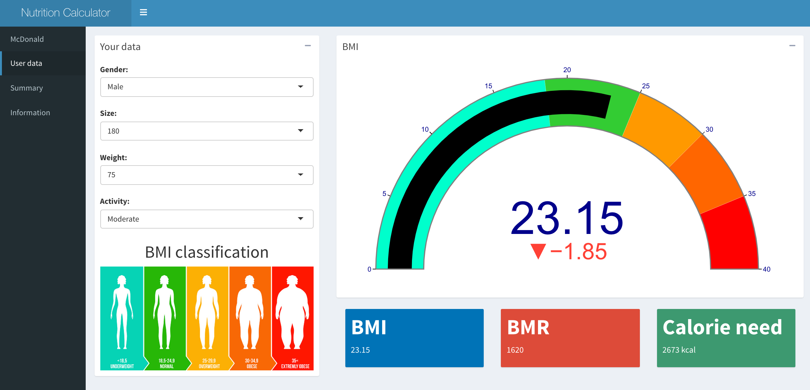
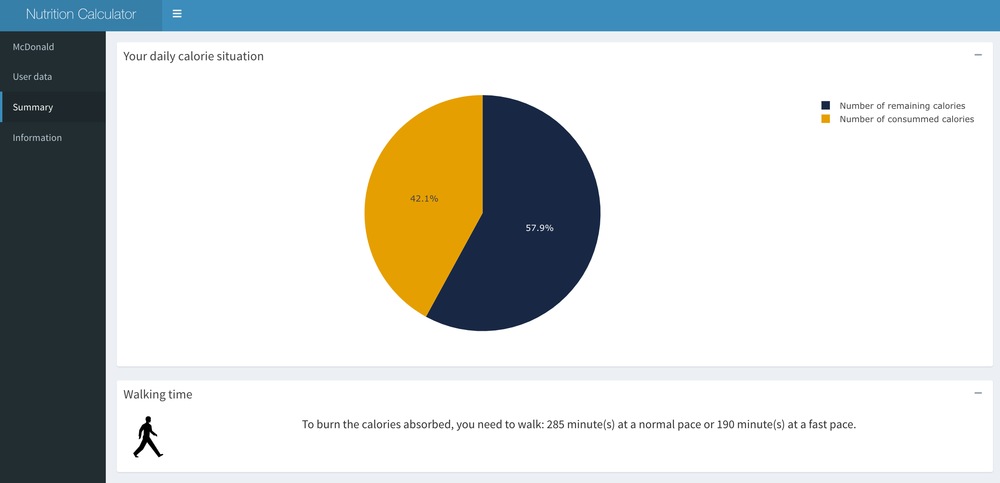
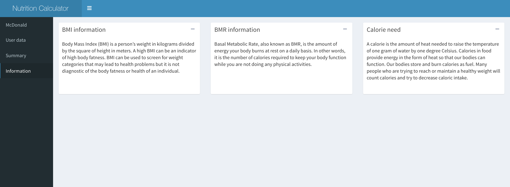

```{r, include = FALSE}
knitr::opts_chunk$set(
  collapse = TRUE,
  comment = "#>"
)

library(dplyr)
```


```{r setup}
library(McDonald)
```

The package McDonald is composed of multiple functions necessary to run our McDonald shiny app: 

- Body Mass Index (BMI)
- Basal Metabolic Rate (BMR)
- Calorie need
- Walking time
- Running the shiny application


## Body Mass Index (BMI)

This function measures the body fat based on the height and the weight of a person. 


$$BMI = Weight/Size^2$$

- Weight in kilograms
- Size in centimeters

```{r message = FALSE, warning=FALSE}
library(McDonald)

x <- 180 #size in centimeters
y <- 75 #weight in kilos
bmi <- McDonald::bmi(x,y)
bmi %>% kableExtra::kable(col.names = "BMI", align = "l")
```

## Basal Metabolic Rate (BMR)

The function calculates the amount of energy expended per day in a neutral environement.

$$BMR = Weight*Coefficient*24*LeanFactor$$

- Weight in kilograms
- Coefficient : male = 1 and female = 0
- Lean factor: depends on the gender and the body fat percentage (BMI) - *See table below*

{width=50%}

```{r message = FALSE, warning=FALSE}
y <- 75 #weight in kilos
coefficient <- 1 #coefficient corresponding to the gender (1 for male and 0.9 for female)
d <- 24 #fix value
leanfactor <- 0.9 #lean factor that correspond to the gender and its respective BMI (see table), here 0.9
bmr <- McDonald::bmr(y, coefficient, d, leanfactor)
bmr %>% kableExtra::kable(col.names = "BMR", align = "l")
```

## Calorie need

This function compute the daily calorie need according to the BMR and the weekly physical activity. 

$$Calories=BMR*multiplier$$

Physical activity (multiplier): 

- Very light = 1.30
- Light = 1.55
- Moderate = 1.65
- Heavy = 1.80
- Very heavy = 2


```{r message = FALSE, warning=FALSE}
multiplier <- 1.65 #depends on your weekly phisical activites, here moderate activity = 1.65
needs <- McDonald::needs(bmr, multiplier)
needs %>% kableExtra::kable(col.names = "Daily calorie need", align = "l")
```

## Walking time

Walking time in minutes needed to burn off the calories absorbed.

$$Walking=Kcal/((MET*3.5*Weight)/200)$$

- Kcal: calories absorbed
- MET: metabolic equivalent of task
    - Walking at a normal pace = 3
    - Walking at fast pace = 4.5
- Weight in kilos


```{r}
y <- 75
MET <- 3 #normal walking = 3, fast walking = 4.5
e <- 3.5
f <- 200
kcal <- 850 #calories absorbed
walking_time <- McDonald::walking_time(y, MET, e, f, kcal) %>% round(digits = 0)
walking_time %>% kableExtra::kable(col.names = "Walking time in minutes at a normal pace", align = "l")

```


## Running the shiny application

```{r eval=FALSE}
McDonald::run()
```


# Shiny app

The shiny app is composed of four tabs: 

- McDonald
- User data
- Summary
- Information

## McDonald 

The Mcdonald tab allows us to choose the menu of which we want to know the nutritional values. Moreover, it provides us with the amount of calories corresponding to the chosen menu. 

The user has to fill in several fields such as the chosen burger, the snack, the sauce, the salad and the drink.

{width=100%}

## User data

The second tab is the user's one. In order to illustrate the user's current health and to know his daily calorie requirement, it is necessary to fill in the following fields: 

- Gender (male or female)
- Size (in centimetres) 
- Weight (in kilos)
- Weekly physical activity
    - Very light
    - Light
    - Moderate 
    - Heavy 
    - Very heavy
    
The outputs is a calculation of the Body Mass Index (BMI), a calculation of the Basal Metabolic Rate (BMR) and the daily calorie requirement.  

Thanks to this tool, consumers can know their state of health and their caloric needs. In addition, they can easily determine how the consumption of a McDonald's menu affects their calorie needs. 

{width=100%}


## Summary

This tab serves as a summary for the consumer. It shows the impact of the number of calories in its McDonald's menu over its daily total. In this way, he knows how many calories he can still consume. In addition, the walking time necessary to burn off the calories absorbed is computed. 


{width=100%}

## Information

The information tab brings more information about health index such as the BMI, the BRM and the calorie need.

{width=100%}
